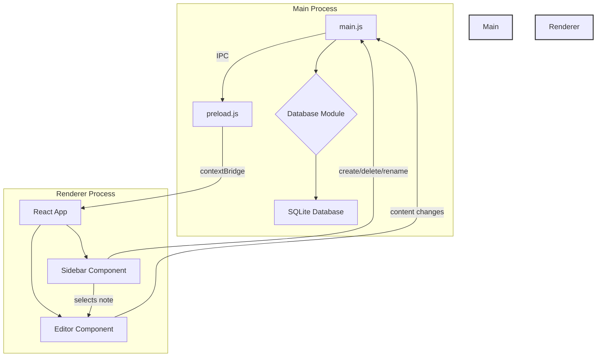

# Design Document

## 1. Overview

This document outlines the technical design for the minimal note-taking application. The application will be a desktop app built with Electron, React, and Tailwind CSS. It will feature a simple, two-pane interface: a sidebar for note management and a main area for content editing with Tiptap. All notes will be persisted in a local SQLite database.

## 2. Architecture

The application will follow a standard Electron architecture with a main process and a renderer process.

*   **Main Process:** Responsible for application lifecycle events (creating windows, quitting), managing the SQLite database connection, and handling all file system and database operations. It will expose an API to the renderer process via IPC (Inter-Process Communication).
*   **Renderer Process:** Responsible for rendering the user interface using React. It will be a single-page application that communicates with the main process via the preload script to perform database operations. It will handle all UI logic, including state management for the note list and editor.



## 3. Components and Interfaces

### 3.1. Main Process Components

*   **`main.js`**: The application entry point. It will create the `BrowserWindow`, load the renderer, and initialize the database connection.
*   **`database.js`**: A module that encapsulates all SQLite database logic. It will use `better-sqlite3` for synchronous database access. It will handle creating the database file if it doesn't exist, and will expose functions for CRUD (Create, Read, Update, Delete) operations on notes.
*   **`preload.js`**: The preload script will use `contextBridge` to securely expose the database API from the main process to the renderer process. It will define an object (e.g., `window.db`) with methods like `getNotes`, `createNote`, `updateNote`, `deleteNote`.

### 3.2. Renderer Process (React) Components

*   **`App.js`**: The root component of the React application. It will manage the overall layout and state, such as the list of notes and the currently selected note.
*   **`Sidebar.js`**: A component that displays the list of notes. It will allow users to create new notes, select a note to view/edit, and right-click to rename or delete a note.
*   **`Editor.js`**: A component that wraps the Tiptap editor. It will receive the content of the selected note as a prop and will use the `useEditor` hook from `@tiptap/react`. It will be configured to automatically save changes to the database by calling the appropriate function from the preload script.
*   **`NoteItem.js`**: A component representing a single note in the sidebar. It will handle the display of the note title and the context menu for rename/delete actions.

## 4. Data Models

A single data model will be used for notes.

**Note:**

*   `id` (INTEGER, PRIMARY KEY, AUTOINCREMENT): Unique identifier for the note.
*   `title` (TEXT): The title of the note.
*   `content` (TEXT): The content of the note, stored as HTML from the Tiptap editor.
*   `createdAt` (DATETIME): The timestamp when the note was created.
*   `updatedAt` (DATETIME): The timestamp when the note was last updated.

The `notes` table will be created in the SQLite database with the following schema:

```sql
CREATE TABLE IF NOT EXISTS notes (
  id INTEGER PRIMARY KEY AUTOINCREMENT,
  title TEXT NOT NULL,
  content TEXT,
  createdAt DATETIME DEFAULT CURRENT_TIMESTAMP,
  updatedAt DATETIME DEFAULT CURRENT_TIMESTAMP
);
```

## 5. Error Handling

*   **Database Errors:** The `database.js` module in the main process will wrap all database operations in `try...catch` blocks. Any errors will be logged to the console and propagated back to the renderer process through the IPC channel. The renderer will then display an appropriate error message to the user (e.g., using a toast notification).
*   **UI Errors:** React's Error Boundaries will be used to catch and handle rendering errors in the UI, preventing the entire application from crashing.

## 6. Testing Strategy

*   **Unit Tests:** Jest will be used for unit testing React components and utility functions in the renderer process.
*   **Integration Tests:** We will write integration tests for the main process, particularly for the `database.js` module, to ensure that the database operations work as expected. These tests can also be run with Jest, but will require a separate test environment configuration.
*   **End-to-End Tests:** While not in the initial scope, a framework like Playwright or Spectron could be used in the future to write end-to-end tests that simulate user interactions with the entire application.