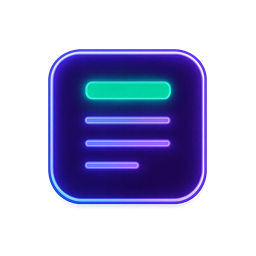
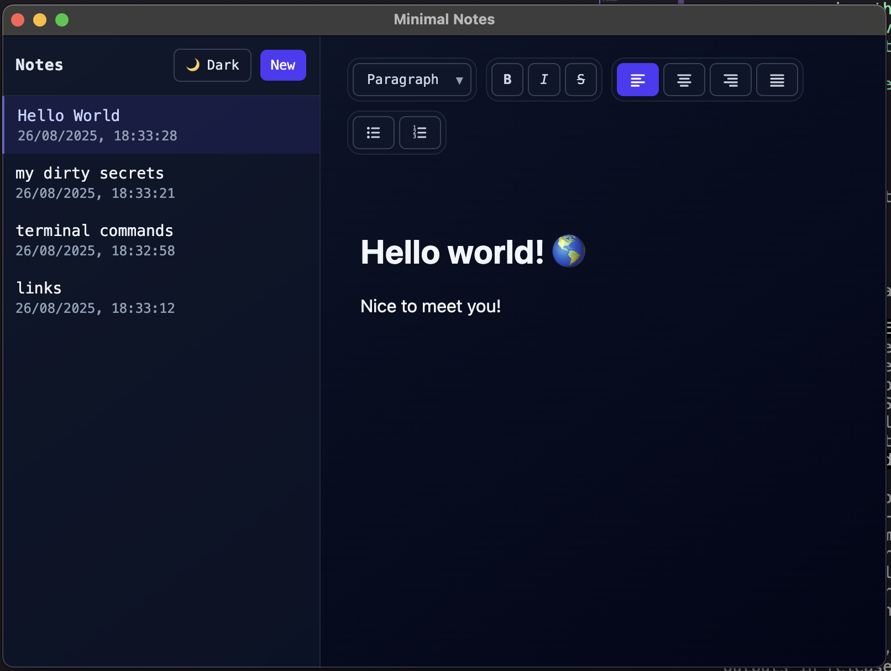

# Minimal Notes



Minimal, fast, fully local notes for desktop. No accounts. No syncing. No tracking. Your notes stay on your machine.



- Downloads: grab installers from the Releases section (on the right in GitHub).
- Platforms: macOS (DMG), Windows (NSIS installer), Linux (AppImage).

## macOS Gatekeeper note (unsigned app)

I don’t currently pay for an Apple Developer account, so the macOS app is not code-signed. After installing (dragging into Applications), run this once before the first launch to remove the quarantine attribute:

```bash
xattr -cr "/Applications/Minimal Notes.app"
```

Then open the app normally.

## Why I built this

I was somewhat inspired by Sam Altman’s thought that SaaS will mimic fast fashion (see https://x.com/sama/status/1952084574366032354). AI enables rapid, low‑cost creation of trendy software, leading to saturation and disposability—speed over lasting quality.

This app exists because it solves my specific need: a dead‑simple, local‑first note‑taking app that doesn’t require an internet connection, doesn’t ask you to sign in, and never sends data anywhere. There are countless note apps; this one deliberately stays small, private, and fast.

## Tech stack

- Electron + React + TypeScript + Vite for the desktop app and renderer.
- Tailwind CSS (typography) for styles.
- Tiptap for rich‑text editing.
- better‑sqlite3 for a local, embedded database (no server).
- electron‑builder for packaging and cross‑platform installers.
- vite-plugin-electron for a smooth Electron + Vite dev/build setup.
- Built with help from AI agentic tools: Gemini CLI and (mostly) Codex CLI.

## Development

Prerequisites:
- Node.js 20+
- npm

Install and run in development mode:
```bash
git clone https://github.com/ferquo/minimal-notes.git
cd minimal-notes
npm ci
npm run dev
```
This starts Vite + Electron in watch mode.

## Build

Create production builds and platform installers:
```bash
npm run build
```

Outputs are written to `release/<version>/` based on the configuration in `electron-builder.json5`:
- macOS: DMG (arm64)
- Windows: NSIS installer (x64)
- Linux: AppImage

Notes:
- Builds are unsigned by default. See the macOS Gatekeeper note above.
- If you run into native module issues locally, reinstall deps (`npm ci`) to fetch prebuilt binaries. CI builds create installers for all platforms.

## Releasing

Releases are built in GitHub Actions. Create a tag like `v1.2.3` and push it (or create a release in the GitHub UI). CI builds the app on macOS, Windows, and Linux and attaches the artifacts to that release.

## Privacy

All data stays on your machine. There is no telemetry, no analytics, and no network syncing.

## License

This project is open source under the MIT License. See the `LICENSE` file for details.
