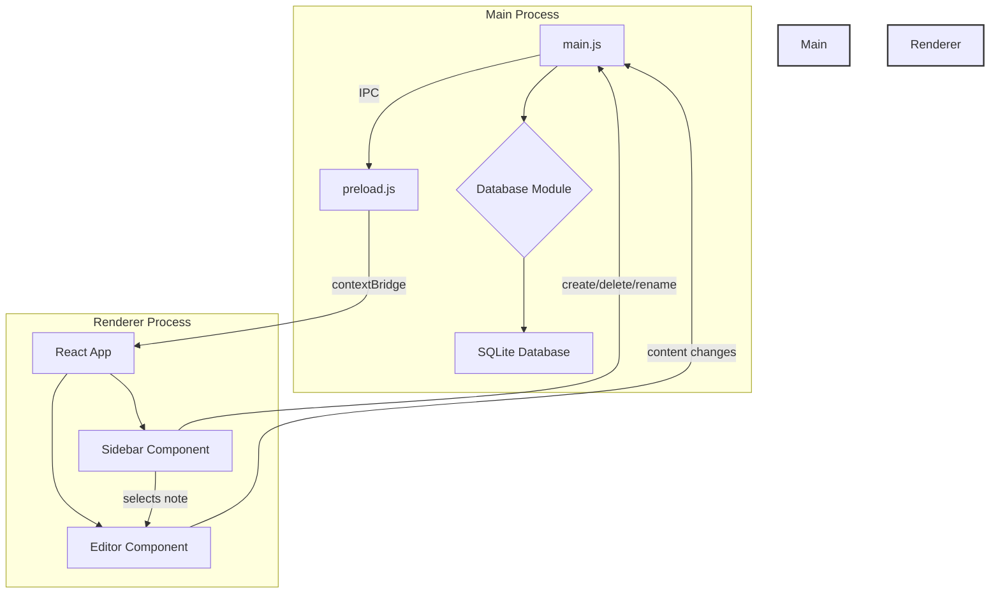

# Merged Requirements

## Design

# Design Document

## 1. Overview

This document outlines the technical design for the minimal note-taking application. The application will be a desktop app built with Electron, React, and Tailwind CSS. It will feature a simple, two-pane interface: a sidebar for note management and a main area for content editing with Tiptap. All notes will be persisted in a local SQLite database.

## 2. Architecture

The application will follow a standard Electron architecture with a main process and a renderer process.

*   **Main Process:** Responsible for application lifecycle events (creating windows, quitting), managing the SQLite database connection, and handling all file system and database operations. It will expose an API to the renderer process via IPC (Inter-Process Communication).
*   **Renderer Process:** Responsible for rendering the user interface using React. It will be a single-page application that communicates with the main process via the preload script to perform database operations. It will handle all UI logic, including state management for the note list and editor.



## 3. Components and Interfaces

### 3.1. Main Process Components

*   **`main.js`**: The application entry point. It will create the `BrowserWindow`, load the renderer, and initialize the database connection.
*   **`database.js`**: A module that encapsulates all SQLite database logic. It will use `better-sqlite3` for synchronous database access. It will handle creating the database file if it doesn't exist, and will expose functions for CRUD (Create, Read, Update, Delete) operations on notes.
*   **`preload.js`**: The preload script will use `contextBridge` to securely expose the database API from the main process to the renderer process. It will define an object (e.g., `window.db`) with methods like `getNotes`, `createNote`, `updateNote`, `deleteNote`.

### 3.2. Renderer Process (React) Components

*   **`App.js`**: The root component of the React application. It will manage the overall layout and state, such as the list of notes and the currently selected note.
*   **`Sidebar.js`**: A component that displays the list of notes. It will allow users to create new notes, select a note to view/edit, and right-click to rename or delete a note.
*   **`Editor.js`**: A component that wraps the Tiptap editor. It will receive the content of the selected note as a prop and will use the `useEditor` hook from `@tiptap/react`. It will be configured to automatically save changes to the database by calling the appropriate function from the preload script.
*   **`NoteItem.js`**: A component representing a single note in the sidebar. It will handle the display of the note title and the context menu for rename/delete actions.

## 4. Data Models

A single data model will be used for notes.

**Note:**

*   `id` (INTEGER, PRIMARY KEY, AUTOINCREMENT): Unique identifier for the note.
*   `title` (TEXT): The title of the note.
*   `content` (TEXT): The content of the note, stored as HTML from the Tiptap editor.
*   `createdAt` (DATETIME): The timestamp when the note was created.
*   `updatedAt` (DATETIME): The timestamp when the note was last updated.

The `notes` table will be created in the SQLite database with the following schema:

```sql
CREATE TABLE IF NOT EXISTS notes (
  id INTEGER PRIMARY KEY AUTOINCREMENT,
  title TEXT NOT NULL,
  content TEXT,
  createdAt DATETIME DEFAULT CURRENT_TIMESTAMP,
  updatedAt DATETIME DEFAULT CURRENT_TIMESTAMP
);
```

## 5. Error Handling

*   **Database Errors:** The `database.js` module in the main process will wrap all database operations in `try...catch` blocks. Any errors will be logged to the console and propagated back to the renderer process through the IPC channel. The renderer will then display an appropriate error message to the user (e.g., using a toast notification).
*   **UI Errors:** React's Error Boundaries will be used to catch and handle rendering errors in the UI, preventing the entire application from crashing.

## 6. Testing Strategy

*   **Unit Tests:** Jest will be used for unit testing React components and utility functions in the renderer process.
*   **Integration Tests:** We will write integration tests for the main process, particularly for the `database.js` module, to ensure that the database operations work as expected. These tests can also be run with Jest, but will require a separate test environment configuration.
*   **End-to-End Tests:** While not in the initial scope, a framework like Playwright or Spectron could be used in the future to write end-to-end tests that simulate user interactions with the entire application.

## Requirements

# Requirements Document

## Introduction

This document outlines the requirements for a minimal note-taking application built with Electron.js and styled with Tailwind CSS. The application will allow users to manage a collection of notes, each with a title and content. The user interface will consist of a sidebar for note management (creating, deleting, renaming) and a main editor area for note content, using Tiptap for rich text editing. All data will be stored locally in a SQLite database.

## Requirements

### Requirement 1: Note Creation

**User Story:** As a user, I want to create a new note, so that I can capture my thoughts and ideas.

#### Acceptance Criteria

1.  WHEN the user clicks the "New Note" button, THEN the system SHALL create a new note with a default title (e.g., "New Note").
2.  WHEN a new note is created, THEN the system SHALL display the new note in the sidebar.
3.  WHEN a new note is created, THEN the system SHALL open the new note in the editor.
4.  IF the database connection is unavailable, THEN the system SHALL display an error message to the user.

### Requirement 2: Note Deletion

**User Story:** As a user, I want to delete an existing note, so that I can remove notes I no longer need.

#### Acceptance Criteria

1.  WHEN the user right-clicks on a note in the sidebar and selects "Delete", THEN the system SHALL prompt the user for confirmation.
2.  IF the user confirms the deletion, THEN the system SHALL remove the note from the sidebar.
3.  IF the user confirms the deletion, THEN the system SHALL remove the note from the database.
4.  IF the user cancels the deletion, THEN the system SHALL NOT remove the note.

### Requirement 3: Note Renaming

**User Story:** As a user, I want to rename a note, so that I can give it a more descriptive title.

#### Acceptance Criteria

1.  WHEN the user right-clicks on a note in the sidebar and selects "Rename", THEN the system SHALL allow the user to edit the note's title in-place.
2.  WHEN the user finishes editing the title and presses Enter, THEN the system SHALL save the new title to the database.
3.  IF the new title is empty, THEN the system SHALL revert to the original title.

### Requirement 4: Note Editing

**User Story:** As a user, I want to edit the content of a note, so that I can write and format my thoughts.

#### Acceptance Criteria

1.  WHEN the user selects a note from the sidebar, THEN the system SHALL display the note's content in the Tiptap editor.
2.  WHEN the user modifies the content in the editor, THEN the system SHALL automatically save the changes to the database.
3.  The editor SHALL support basic formatting (bold, italic, lists).

### Requirement 5: Note Persistence

**User Story:** As a user, I want my notes to be saved automatically, so that I don't lose my work.

#### Acceptance Criteria

1.  WHEN a note's title or content is changed, THEN the system SHALL save the changes to the SQLite database.
2.  WHEN the application is closed and reopened, THEN the system SHALL load all existing notes from the database.

### Requirement 6: User Interface

**User Story:** As a user, I want a simple and intuitive interface, so that I can focus on taking notes.

#### Acceptance Criteria

1.  The application SHALL have a single window.
2.  The window SHALL be divided into a sidebar on the left and a main content area on the right.
3.  The sidebar SHALL display a list of note titles.
4.  The main content area SHALL contain the Tiptap editor.
5.  The application's styling SHALL be implemented using Tailwind CSS.

## Implementation Plan

# Implementation Plan

This plan outlines the steps to implement the minimal note-taking app. Each step is designed to be an incremental and testable unit of work.

- [x] 1. **Project Setup**
    - [x] 1.1. Initialize a new Electron project using a suitable boilerplate (e.g., `electron-react-boilerplate` or a similar template with Vite).
        - _Requirements: 6.1, 6.5_
    - [x] 1.2. Install and configure Tailwind CSS for styling.
        - _Requirements: 6.5_
    - [x] 1.3. Install `better-sqlite3` for database interaction and `@tiptap/react` and `@tiptap/starter-kit` for the editor.
        - _Requirements: 5.1_

- [x] 2. **Database and Main Process Logic**
    - [x] 2.1. Create a `database.js` module in the main process to handle all SQLite operations.
        - Implement functions for `init`, `getNotes`, `createNote`, `updateNoteTitle`, `updateNoteContent`, and `deleteNote`.
        - The `init` function should create the `notes` table if it doesn't exist.
        - _Requirements: 5.1, 5.2_
    - [x] 2.2. In `main.js`, initialize the database connection when the app starts.
        - _Requirements: 5.2_
    - [x] 2.3. Create a `preload.js` script to expose the database functions to the renderer process using `contextBridge`.
        - Expose the functions as `window.db.getNotes`, `window.db.createNote`, etc.
        - _Requirements: 5.1, 5.2_

- [ ] 3. **Core UI Components**
    - [ ] 3.1. Create the main `App.js` component with a two-column layout (sidebar and main content area) using Tailwind CSS.
        - _Requirements: 6.2_
    - [ ] 3.2. Create the `Sidebar.js` component.
        - It should fetch and display the list of notes from the database on component mount using the exposed preload functions.
        - Implement a "New Note" button that calls the `createNote` function and refreshes the note list.
        - _Requirements: 1.1, 1.2, 6.3_
    - [ ] 3.3. Create the `NoteItem.js` component to display a single note title in the sidebar.
        - Implement a click handler to set the currently selected note in the `App.js` state.
        - _Requirements: 4.1_
    - [ ] 3.4. Create the `Editor.js` component.
        - Use the `@tiptap/react` `useEditor` hook to create a Tiptap instance.
        - Configure the `StarterKit` for basic formatting.
        - The editor's content should be updated when a new note is selected.
        - _Requirements: 4.1, 4.3_

- [x] 4. **Connecting UI to Functionality**
    - [x] 4.1. Implement the logic to pass the selected note's content to the `Editor.js` component.
        - _Requirements: 4.1_
    - [x] 4.2. In the `Editor.js` component, add logic to automatically save the note's content when it changes.
        - Use a debounced function to call `window.db.updateNoteContent` to avoid excessive database writes.
        - _Requirements: 4.2, 5.1_
    - [x] 4.3. Implement the note deletion functionality.
        - Add a context menu (on right-click) to the `NoteItem.js` component with a "Delete" option.
        - The "Delete" option should show a confirmation dialog before calling `window.db.deleteNote`.
        - After deletion, the note list in the sidebar should be refreshed.
        - _Requirements: 2.1, 2.2, 2.3, 2.4_
    - [x] 4.4. Implement the note renaming functionality.
        - Add a "Rename" option to the context menu in `NoteItem.js`.
        - When clicked, the note title should become an editable input field.
        - On blur or Enter, the new title should be saved using `window.db.updateNoteTitle`, and the note list should be refreshed.
        - _Requirements: 3.1, 3.2, 3.3_

- [ ] 5. **Final Touches**
    - [ ] 5.1. Add basic error handling to display alerts or notifications for database errors.
        - _Requirements: 1.4_
    - [ ] 5.2. Style the application using Tailwind CSS to match the minimal design aesthetic.
        - _Requirements: 6.5_

- [ ] 6. **Testing**
    - [ ] 6.1. Write unit tests for the `database.js` module to ensure all CRUD operations work correctly.
    - [ ] 6.2. Write basic component tests for the React components to verify they render correctly.
